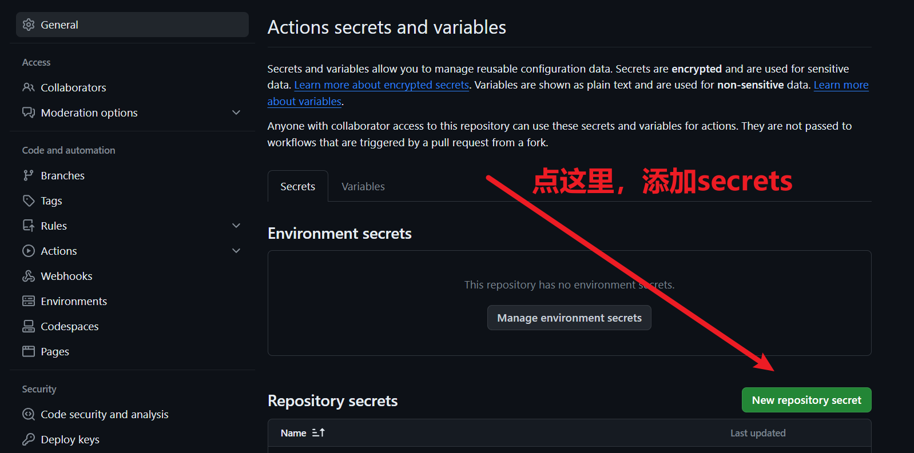
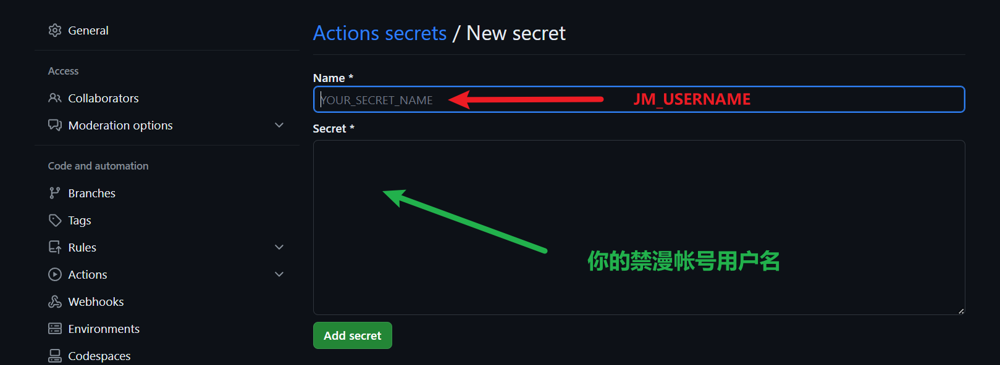

# 导出并下载你的禁漫收藏夹数据

一共需要三步：

1. fork一份我的代码仓库。
2. 配置你的禁漫帐号密码，最好使用secrets保证不会泄漏信息。 
（虽然也支持通过工作流dispatch输入帐号密码，但是这种方式会让账号密码明文显示在Actions日志中。
如果你打算采用后者，最好下载完就及时删除工作流。）
3. 运行工作流，下载结果。

下面截图解析这三步的详细过程。

## 1. fork一份我的代码仓库

访问下面这个网址：

`https://github.com/hect0x7/JMComic-Crawler-Python/fork`

直接拉到页面最底部，如下所示：

（最新提示，下图的1可以不做，即直接点绿色的Create fork按钮）

## 2. 配置你的禁漫帐号密码

在开始下面的步骤之前，你需要先启用你的repo的Actions，开启方式如下：

然后访问下面这个网址：

`https://github.com/你的用户名/JMComic-Crawler-Python/settings/secrets/actions`

按下图步骤进行操作：

然后来到填写页面

你需要填入下面的内容，并点【Add secret】保存：

`JM_USERNAME`: 你的禁漫帐号用户名

同样的方式再配置如下内容：

`JM_PASSWORD`: 你的禁漫帐号密码
`ZIP_PASSWORD`: 压缩文件密码，防止别人下载使用你的文件

## 3. 等待GitHub Actions下载完成，下载成品zip文件

来到Actions页面，选择最新的一次记录，等待它完成。

完成以后，在页面最底部，点击下载你的成品即可。
