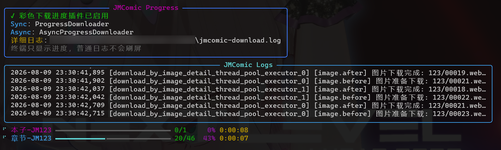

# 下载进度展示（插件）

使用 `download_album` 下载多章节本子时，默认日志会不断换行，很难一眼看出整本和各章节的下载进度。

自 `v2.7.4` 起，jmcomic 内置了美观的下载进度条，效果如下：



这个进度条有两种使用方式，命令行 / 代码。两种需要安装前置依赖，命令：`pip install rich`。


- 命令行： 安装 `rich` 后，使用 `jmcomic` 命令默认会开启上述进度条。禁用需使用 `--no-progress` 参数。

- 代码：需要通过配置插件 `download_progress` 来开启，见下面的教程章节。


## 进度条的效果介绍

- 接管原 jmcomic 日志，把日志拆为3个固定区域：`提示区`，`日志区`，`进度条区`
- 日志区固定显示最近 6 条 jmcomic 日志。
- 进度条区显示本子、章节两级下载进度。
  - 本子进度 = 已下载章节 / 总章节
  - 章节进度 = 已下载图片 / 总图片。
- 将原日志完整写入 `./jmcomic-download.log` 文件。
- 同时支持普通下载和异步下载 API。

> [!WARNING]
> **为什么有些窗口不显示动态进度？**
>
> 动态进度条不是不断打印新行，而是反复覆盖终端中的同一块区域。PowerShell、Windows Terminal 等终端支持这种刷新方式，因此可以让日志固定在上方、进度条固定在下方。
>
> PyCharm 的 **Run 运行面板**以及部分 IDE 输出窗口会把程序输出当成普通文本，无法正确覆盖旧内容。如果强行刷新，每一帧都会变成新的一行，最终造成刷屏。
>
> 因此，插件会自动判断当前窗口是否支持动态刷新：
>
> - 支持：显示固定日志区和两级进度条。
> - 不支持：启动时显示一次说明，下载期间不刷新，结束后输出一次本子、章节和图片数量汇总。
>
> 如果你使用 PyCharm，请在底部的 **Terminal** 中运行 `python script.py`，即可查看动态进度。


| 运行位置 | 下载期间 | 下载结束后 |
| --- | --- | --- |
| Terminal、PowerShell | 上方固定显示最近 6 条日志，下方实时刷新本子和章节进度条 | 进度条停留在完成状态 |
| PyCharm Run 等普通输出窗口 | 不刷新进度，避免重复打印造成刷屏 | 输出一次本子、章节和图片数量汇总 |

两种模式都会将完整日志追加到 `jmcomic-download.log`。下载入口和并发调度仍由 jmcomic 负责，插件只负责展示进度。


## 代码方式启用教程

### 1. 安装

使用插件前需要额外安装 `rich`:

```shell
pip install -U jmcomic rich
```

### 2. 使用插件

```python
from jmcomic import create_option_by_str, download_album

option = create_option_by_str('''
plugins:
  after_init:
    - plugin: download_progress
''')

download_album('123456', option)
```

异步版本也支持：

```python
import asyncio

from jmcomic import create_option_by_str, download_album_async

option = create_option_by_str('''
plugins:
  after_init:
    - plugin: download_progress
''')

asyncio.run(download_album_async('123456', option))
```

图片和 `jmcomic-download.log` 默认保存在运行命令的当前目录中。重复运行时，新日志会追加到已有日志文件末尾。
