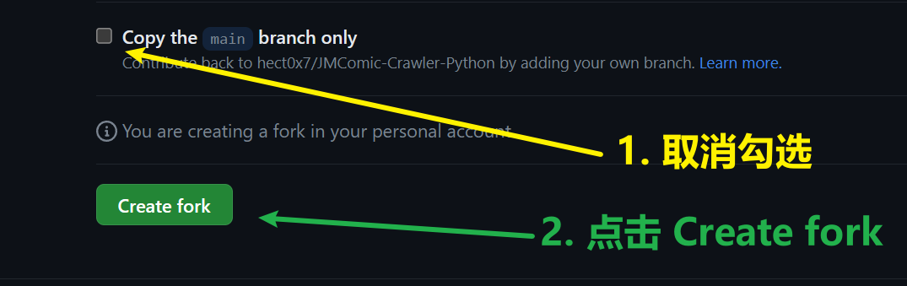
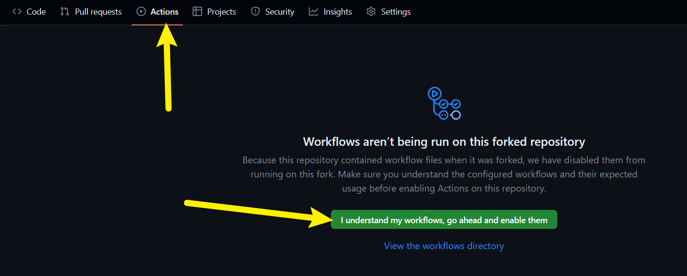
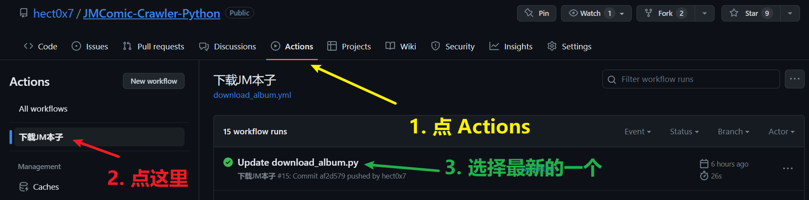
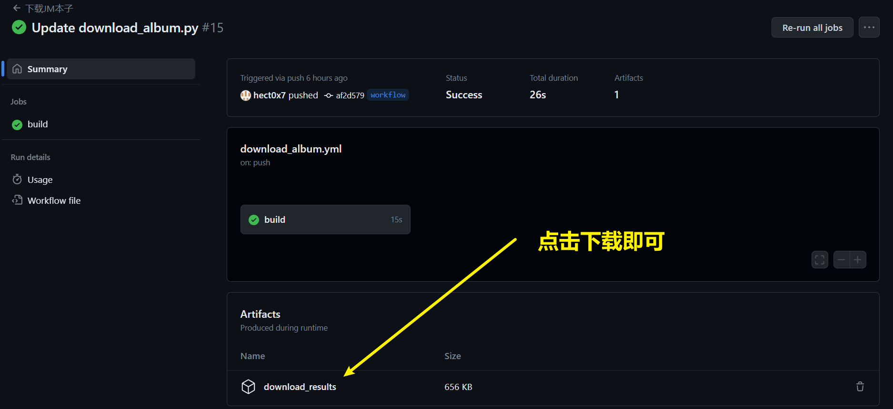

# GitHub Actions使用教程

一共需要三步：

1. fork一份我的代码仓库。
2. 填写你需要下载的本子id。
3. 等待GitHub Actions下载完成，下载成品zip文件。

下面截图解析这三步的详细过程。

## 1. fork一份我的代码仓库

访问下面这个网址：

`https://github.com/hect0x7/JMComic-Crawler-Python/fork`

直接拉到页面最底部，如下所示：

（最新提示，下图的1可以不做，即直接点绿色的Create fork按钮）

## 2. 填写你需要下载的本子id

在开始下面的步骤之前，你需要先启用你的repo的Actions，开启方式如下：

### 2.1. 方式一（最新、简单、推荐）

访问下面这个网址：

`https://github.com/你的用户名/JMComic-Crawler-Python/actions/workflows/download_dispatch.yml`

按下图步骤进行操作：

### 2.2. 方式二

访问下面这个网址：

`https://github.com/你的用户名/JMComic-Crawler-Python/edit/master/usage/workflow_download.py`

其实就是编辑 `usage/workflow_download.py`文件，任意分支皆可。

按下图步骤进行操作：

看到上面的绿色框里的代码了吗？（位置可能有些变化）

上面有注释，把你要下载的本子的id填入，一行一个，id前面可以带`JM`。

填完点提交，会自动触发GitHub Actions下载这些本子。

## 3. 等待GitHub Actions下载完成，下载成品zip文件

来到Actions页面，选择最新的一次记录，等待它完成。

完成以后，在页面最底部，点击下载你的成品即可。

如果你发现GitHub Actions显示❌，表明出现了问题，运行失败。

下面是问题的排查步骤：

1. 检查你在步骤2中填写是否有误。
2. 点进build，查看运行流程，找到`运行下载脚本`这个步骤，查看报错的具体信息
3. 来到我的项目仓库，点进Issue，先根据报错信息搜索Issue，如果能搜到类似问题，自行参考解决。
4. 如果还是不知道如何解决，提一个Issue，详细描述下你的问题。
